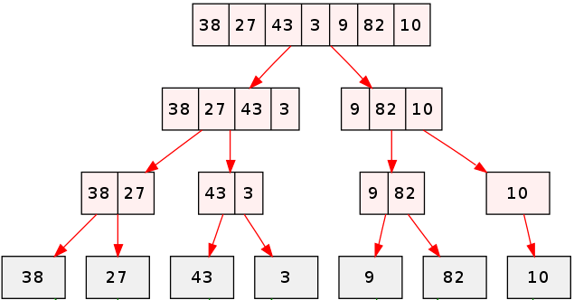
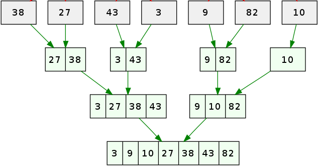

# Algoritmos de Ordenação
Estudar algoritmos de ordenação, apesar de parecer algo teórico demais, pode melhorar nossa lógica de programação e nos ajudar a escolher o melhor algoritmo pra lidar com dados específicos.

Nesse repositório eu irei falar sobre os algoritmos:\
**Selection Sort**\
**Bubble Sort**\
**Insertion Sort**\
**Merge Sort**\
**Quick Sort**

Você pode verificar a implementação dos algoritmos em Python nessa [pasta](https://github.com/Marcozz-716/algoritmos-de-ordenacao/tree/main/algoritmos)

## Selection Sort
O Selection Sort funciona dividindo os dados em duas partes: ordenados e não ordenados. Ele busca o menor elemento do conjunto, colocando-o no início e avançando para a direita para ordenar os demais elementos. 

O fluxo é basicamente:\
**1 - Encontrar o elemento mínimo entre os dados**

```python
lista = [75, 12, 7, 8, 36]
menor_elemento_id = 0
for i in range(len(lista)):
    if lista[i] < lista[menor_elemento_id]:
        menor_elemento_id = i
```
</br>

**2 - Trocar o elemento mínimo encontrado com o elemento de primeiro índice**

```python
lista = [75, 12, 7, 8, 36]
menor_elemento_id = 0
for i in range(len(lista)):
    if lista[i] < lista[menor_elemento_id]:
        menor_elemento_id = i
limite = 0
# Trocando a ordem
if lista[limite] > lista[menor_elemento_id]:
    var_aux = lista[limite]
    lista[limite] = lista[menor_elemento_id]
    lista[menor_elemento_id] = var_aux
```
</br>

**3 - Mover o limite para a direita e repetir até ordenar tudo**

```python
lista = [75, 12, 7, 8, 36]
for actual in range(len(lista) - 1):
    min_id = actual
    for i in range(actual, len(lista)):
        if lista[min_id] > lista[i]:
            print(f"{lista[min_id]} maior que {lista[i]}")
            min_id = i

    if lista[actual] > lista[min_id]:
        aux = lista[actual] 
        lista[actual] = lista[min_id]
        lista[min_id] = aux
return lista
```
</br>

**Vantagens do Selection Sort:** Fácil de implementar e funciona bem para listas pequenas.
</br>
**Desvantagens do Selection Sort:** Não é tão eficiente pra listas grandes.

## Bubble Sort
O Bubble Sort trabalha verificando os elementos de dois em dois. Ele começa analisando a primeira dupla de valores, deixando o valor mínimo na parte esquerda da dupla (se a dupla for [9, 4] o algoritmo transformará em [4, 9]). 

```python
lista = [4, 9, 2, 1, 7, 8]
def bubble_sort(lista):
    for i in range(len(lista) - 1):
        if lista[i+1] < lista[i]:
            lista[i], lista[i+1] = lista[i+1], lista[i]
    return lista
```
</br>
A função acima tem o output
`[4, 2, 1, 7, 8, 9]`
, o que ainda não é satisfatório. Para garantir que o a sequência seja ordenada nós podemos executar um laço dentro de outro que usa o mesmo intervalo:

```python
def bubble_sort2(lista):
    for _ in range(len(lista) - 1):
        for i in range(len(lista) - 1):
            if lista[i+1] < lista[i]:
                lista[i], lista[i+1] = lista[i+1], lista[i] # troca sem variável auxiliar
    return lista
```
**Vantagens do Bubble Sort:** Também é fácil de implementar e funciona bem para listas pequenas e é mais adaptável.
</br>
**Desvantagens do Bubble Sort:** Também tem eficiência menor para grandes estruturas e faz mais trocas que o `Selection Sort`.

## Insertion Sort
O Insertion Sort, por sua vez, começa pelo segundo elemento da estrutura de dados e "insere" os dados na posição correta, movendo os elementos maiores para a direita, se necessário. 
Suponhamos que a estrutura em questão seja a lista
`[4, 7, 2, 5, 4, 0]`
. O algoritmo começa pelo número 7, verifica que não é necessário fazer mudanças e vai para o próximo índice. Na segunda iteração ele verifica que o 2 é menor que o 7 e faz uma troca. Ele faz isso até que a estrutura esteja ordenada. 
```python
def insertion_sort(lista):
    for i in range(1, len(lista)):
        chave = lista[i]
        anterior_id = i - 1
        while anterior_id >= 0 and lista[anterior_id] > chave:
            lista[anterior_id + 1], lista[anterior_id] = lista[anterior_id], lista[anterior_id + 1]
            anterior_id -= 1
    return lista
```
**Vantagens do Insert Sort:** Fácil de implementar e eficiente em listas já quase ordenadas.
</br>
**Desvantagens do Insert Sort:** Também tem eficiência menor para grandes estruturas de dados

## Merge Sort
O Merge Sort tem um jeito diferente de estruturar conjuntos de dados, baseando-se no princípio de "dividir para conquistar". Na prática ele pega o conjunto de dados e divide até que todo o conjunto se transforme em subconjuntos de apenas 1 elemento, então se a lista for
`[38, 27, 43, 3, 9, 82, 10]`
, o fluxo seria o seguinte:
</br>


</br>

Após a divisão é necessário mesclar tudo novamente, porém ordenando:
</br>


</br>
Para implementar esse algoritmo podemos inicialmente construir a função principal 
`merge_sort` 
que recebe como parâmetro a lista. Podemos usar a recursividade para dividir a lista **até que as sublistas tenham um elemento cada uma** :
```python
def merge_sort(list_):
    if len(list_) > 1:
        mid = len(list_)//2
        left = list_[:mid]
        right = list_[mid:]

        left = merge_sort(left)
        right = merge_sort(right)

        return merge(left, right)
    return list_
```
Dividir as sublistas em direita e esquerda torna a implementação mais simples. Agora devemos criar a função
`merge`
para mesclar e ordenar as sublistas:
```python
def merge(list_left, list_right):
    sorted_list = []
    count_left = count_right = 0 # para percorrer as listas
    while count_left < len(list_left) and count_right < len(list_right):
        if list_left[count_left] < list_right[count_right]:
            sorted_list.append(list_left[count_left])
            count_left += 1
        else:
            sorted_list.append(list_right[count_right])
            count_right += 1
    print(sorted_list)
    
    # Para juntar as listas ordenadas
    sorted_list.extend(list_left[count_left:])
    sorted_list.extend(list_right[count_right:])

    return sorted_list
```
